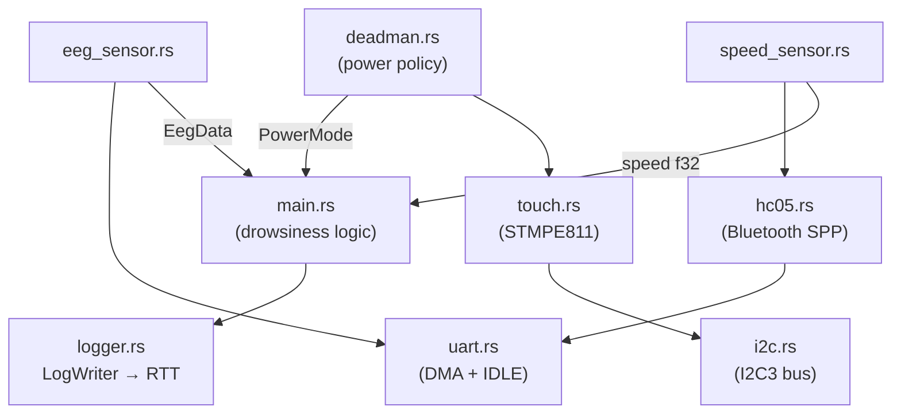
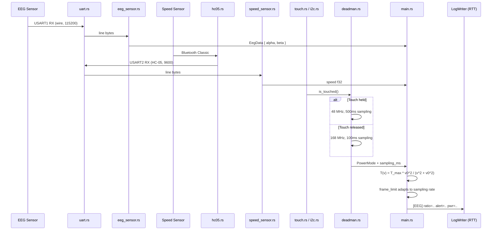

# EEG Drowsiness Detection

Real-time drowsiness detection for STM32F429 using EEG alpha/beta ratio and vehicle speed, with a dead man's switch for adaptive power management. Built with RTIC.

## Module Graph



## Data Flow



## Architecture

- **uart.rs** — shared UART+DMA module. Circular DMA, IDLE interrupt, line assembly. Used by both sensors.
- **hc05.rs** — HC-05 Bluetooth Classic (SPP) wrapper over `uart.rs`.
- **i2c.rs** — shared I2C3 driver (PA8 SCL, PC9 SDA). Used by the touch controller.
- **touch.rs** — STMPE811 touch controller driver. Reports touch held/released.
- **deadman.rs** — dead man's switch policy. Touch held = low power (48 MHz, 500ms sampling). Released = full power (168 MHz, 100ms). Handles clock scaling and UART baud recalculation.
- **eeg_sensor.rs** — USART1, parses `E,alpha,beta`, delivers `EegData`.
- **speed_sensor.rs** — USART2 via HC-05, parses `S,speed`, delivers speed.
- **main.rs** — orchestrator. Drowsiness detection with adaptive persistence window `T(v) = T_max * v0^2 / (v^2 + v0^2)`. Frame limit adapts to the current sampling rate from the dead man's switch.
- **logger.rs** — RTT output to `cargo run` terminal.

## Dead Man's Switch

| State | Clock | Sampling | Rationale |
|---|---|---|---|
| Touch held | 48 MHz | 500 ms | Driver is attentive — save power |
| Touch released | 168 MHz | 100 ms | Driver may be drowsy — monitor aggressively |

## Running

Flash and open RTT log:
```sh
cargo run --release
```

Stream simulated sensor data from PC:
```sh
python reader.py
```

Configure `COM_PORT_EEG` and `COM_PORT_SPEED` in `reader.py` to match your adapters.
