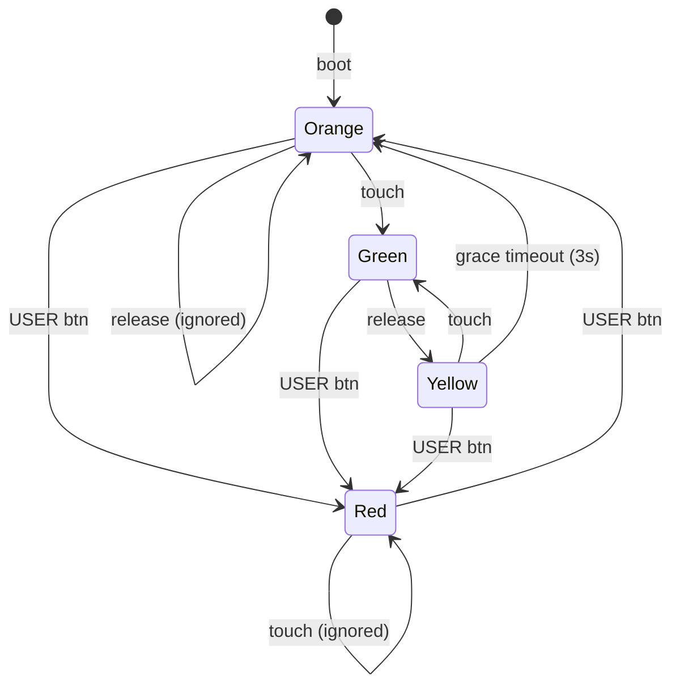

# EEG Drowsiness Detection

Real-time drowsiness detection on STM32F429 Discovery using EEG alpha/beta ratio, with a dead man's switch for adaptive power management. Built with RTIC 1.x (no_std, no heap).

## Event-Driven Architecture

The system is fully event-dispatched — zero polling, zero main loop. Every action is triggered by a hardware interrupt and handled through RTIC's priority-based task system.

### Interrupt Map

| Vector | Source | Priority | Role |
|--------|--------|----------|------|
| `USART1` | EEG sensor IDLE line | default | Extracts `"E,alpha,beta"` packets via DMA circular buffer |
| `USART2` | HC-05 Bluetooth IDLE line | default | Extracts both `"E,..."` and `"S,..."` packets via DMA |
| `EXTI15` | STMPE811 touch INT (PA15, falling edge) | **3** (high) | Clears EXTI pending, spawns `handle_touch` — returns in ~100 ns |
| `EXTI0` | USER button (PA0, rising edge) | default | Toggles Red override state |
| `TIM2` | Grace period one-shot (3 s) | default | Yellow → Orange transition |
| `TIM3` | LED blink timer (~4 Hz) | default | Toggles both LEDs in Red state |

### Software Task Dispatchers

RTIC needs free interrupt vectors to dispatch software tasks. The dispatchers are hardware interrupts that we "donate" to RTIC — they never fire from actual hardware, RTIC triggers them internally to run deferred work:

```
dispatchers = [SPI4, EXTI1, EXTI2, EXTI3]
```

**Why SPI4 instead of EXTI0?** EXTI0 is the USER button interrupt. If RTIC used it as a dispatcher, button presses would collide with task dispatch. SPI4 is unused peripheral hardware on this board — safe to repurpose.

These dispatchers run the software tasks:
- **`handle_touch`** — deferred I2C read + state machine transition (~800 us)
- **`drowsiness_check`** — EEG ratio computation + alert escalation
- **`update_speed`** — stores latest speed value

### How This Prevents the Screen Freeze Bug

The classic embedded bug: a slow I2C transaction inside a high-priority ISR blocks everything — UART data is lost, RTT logging freezes, the system appears hung.

Our architecture splits touch handling into two layers:

```
EXTI15 ISR (priority 3, ~100 ns)          ← fast: just clears pending + spawns
    └──► handle_touch (priority 1, ~800 us)  ← slow: blocking I2C happens here
```

1. **EXTI15** fires at priority 3, clears the EXTI pending bit, calls `handle_touch::spawn()`, and exits in ~100 ns. No I2C, no blocking.
2. **`handle_touch`** runs at priority 1 (lowest). The ~800 us of blocking I2C reads/writes happen here. During this time, USART1/USART2 interrupts (higher priority) still fire and DMA keeps buffering incoming data. RTT logging continues. Nothing freezes.
3. Every I2C wait loop has a **hard timeout** (100K iterations). If the bus locks up, the call returns `false`/`None` instead of hanging forever.

### Deadlock Prevention

RTIC uses the **Priority Ceiling Protocol** — mathematically proven deadlock-free. The rules:

- Shared resources are accessed via `.lock()` which raises the caller's priority to the ceiling (highest priority of any task that uses that resource)
- No task can preempt another while it holds the same resource
- No circular wait is possible — priority ordering prevents it
- No mutexes, no spinlocks, no `critical_section!` needed

Additionally:
- All I2C transactions have hard timeouts — no infinite wait loops
- `stop_grace_timer()` waits for STOP bit to clear before issuing START (prevents I2C START/STOP race)
- Bus recovery runs at boot (bit-bang SCL to free stuck STMPE811)
- DMA runs independently of CPU — UART data is buffered even during I2C blocking

## Dead Man's Switch



| State | Power Mode | Clock | Sampling | Behaviour |
|-------|-----------|-------|----------|-----------|
| Green | Low | 48 MHz | 500 ms (skip 4/5 packets) | Touch held — driver attentive, save power |
| Yellow | Low | 48 MHz | 500 ms | Grace period — 3 s before full monitoring |
| Orange | Full | 168 MHz | 100 ms (every packet) | Active monitoring — full speed |
| Red | Full | 168 MHz | 100 ms | Manual override — touch ignored, LEDs blink |

Low power mode is genuine: PLL reconfigures from 168 → 48 MHz, and 4 out of 5 EEG packets are skipped at the application layer.

## Alert Escalation

Drowsiness is detected when the EEG alpha/beta ratio exceeds 1.2. Rather than using fixed frame thresholds, the number of consecutive drowsy frames required to trigger an alert **scales with vehicle speed** — faster speeds demand a faster reaction.

### How Speed-Adaptive Thresholds Work

At a reference speed of 60 km/h, Alert2 is designed to trigger within ~5 metres of travel. As speed increases, fewer frames are needed to stay within that distance budget. As speed decreases, more frames are required — avoiding false alarms when the driver is barely moving.

```
scale  = V_REF / current_speed        (V_REF = 60 km/h)
t1_raw = ALERT1_BASE × scale          (ALERT1_BASE = 1.5)
t2_raw = ALERT2_BASE × scale          (ALERT2_BASE = 3.0)
t1, t2 = clamped to MIN_FRAMES = 2   (noise floor)
```

### Thresholds by Speed (Full Power, 100 ms per packet)

| Speed | Alert1 frames (t1) | Alert2 frames (t2) | Packets to Alert1 | Packets to Alert2 |
|-------|--------------------|--------------------|-------------------|-------------------|
| ≤10 km/h | 9 | 18 | 9 packets | 18 packets |
| 30 km/h | 3 | 6 | 3 packets | 6 packets |
| 60 km/h | 2 | 3 | 2 packets | 3 packets |
| 90 km/h | 2 | 2 | 2 packets | 2 packets |
| 120 km/h | 2 | 2 | 2 packets | 2 packets |

### Reaction Times by Speed (Full Power, 100 ms per packet)

| Speed | Alert1 time | Alert2 time |
|-------|-------------|-------------|
| ≤10 km/h | 900 ms | 1800 ms |
| 30 km/h | 300 ms | 600 ms |
| 60 km/h | 200 ms | 300 ms |
| 90 km/h | 200 ms | 200 ms |
| 120 km/h | 200 ms | 200 ms |

Above 90 km/h both thresholds hit the 2-frame noise floor — Alert1 and Alert2 trigger simultaneously. Below 90 km/h they remain distinct, giving a warning (Alert1) before the critical alert (Alert2).

### De-escalation

| Condition | Effect |
|-----------|--------|
| 5 consecutive normal frames | Drop one level: Alert2 → Alert1, Alert1 → None |

A single normal frame resets the drowsy counter. A single drowsy frame resets the normal counter. Streaks must be unbroken.

## LED Indicators (PG13 green, PG14 red)

| State | Green LED | Red LED |
|-------|-----------|---------|
| Green | ON | OFF |
| Yellow | ON | ON (amber) |
| Orange | OFF | ON |
| Red | Blink ~4 Hz | Blink ~4 Hz |

## Testing

```sh
cargo test --target x86_64-pc-windows-msvc
```

53 tests covering: alert state machine, EEG/speed parsers, deadman transitions, and dataset integration (15 real EEG rows fed through the full pipeline).

Hardware modules are gated behind `#[cfg(not(test))]` so pure logic compiles on the host while the embedded build is unaffected.

## Running

```sh
cargo build --release          # build firmware
cargo run --release            # flash + open RTT log
python reader.py               # stream simulated EEG + speed via Bluetooth
```

`reader.py` sends both EEG and speed data over HC-05 Bluetooth (COM7, 9600 baud).
